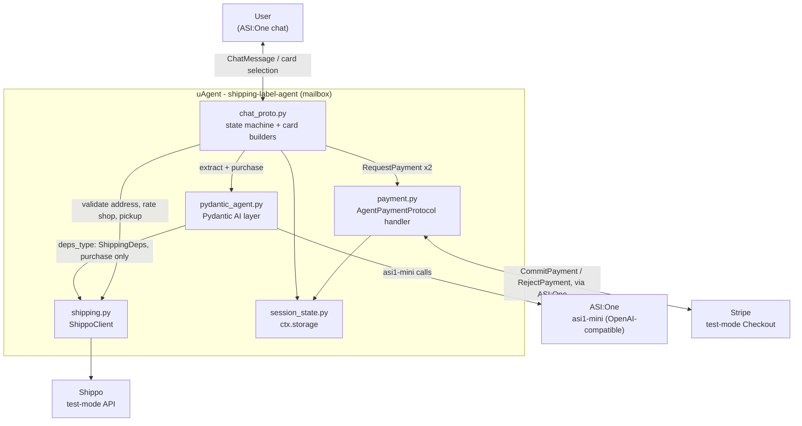
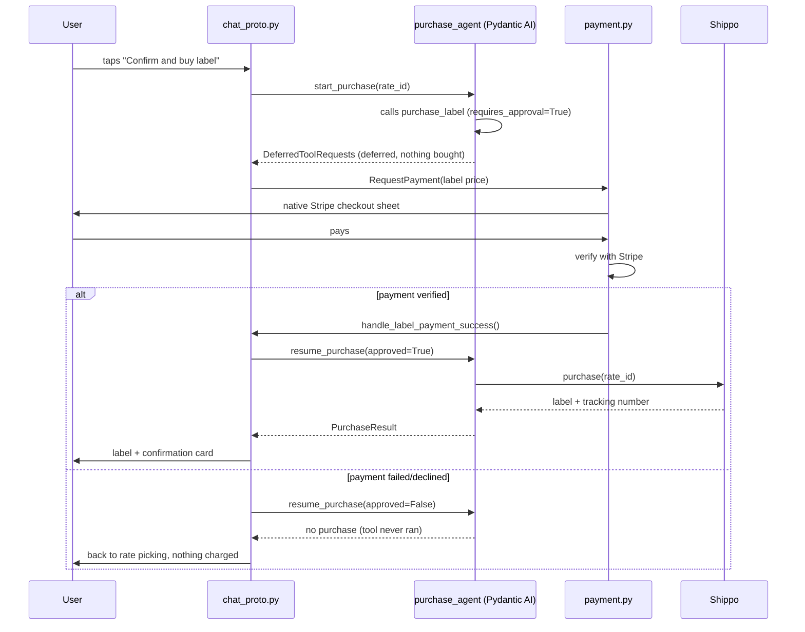

# Architecture

## Components



Two uAgent protocols are mounted on the same agent: `AgentChatProtocol` (`chat_proto.py`)
drives the card-based conversation, and `AgentPaymentProtocol` (`payment.py`) drives both
Stripe charges. Both read and write the same session record in `ctx.storage`
(`session_state.py`), which is how a payment confirmation on one protocol resumes a
conversation in progress on the other.

`pydantic_agent.py` is the only module that talks to ASI:One or holds business logic
about *how* a package gets extracted or a label gets bought. `chat_proto.py` calls into
it and renders whatever it returns as cards; it has no model-calling logic of its own.
It does, however, call `ShippoClient` directly for everything except the actual purchase:
address validation, rate shopping, and pickup scheduling all happen straight from
`chat_proto.py`. Only `purchase_label` runs behind the Pydantic AI layer, reached through
`ShippingDeps` dependency injection so `requires_approval` can gate that one call.

`payment.py`'s two direct calls to Stripe (`create_checkout_session`, `verify_paid`) are
plain REST calls out to Stripe's API. The `CommitPayment`/`RejectPayment` messages coming
back, by contrast, arrive over the same mailbox/ASI:One channel as the chat protocol, not
from Stripe directly; ASI:One is what renders the embedded Stripe checkout and relays the
outcome back to the agent.

## Where Pydantic AI fits

Three `pydantic_agent.py` agents do the actual reasoning; everything else is plumbing.


| Agent                  | Feature                                                   | What it's for                                               |
| ---------------------- | --------------------------------------------------------- | ----------------------------------------------------------- |
| `extract_agent`        | `output_type=PackageDetails`                              | Turns free-text package descriptions into a typed model.    |
| `sender_extract_agent` | `output_type=SenderProfile`                               | Same idea, for the ship-from profile.                       |
| `purchase_agent`       | `deps_type=ShippingDeps`, `@tool(requires_approval=True)` | Buys the label, but only on an explicitly approved resume. |


`purchase_agent` is the centerpiece. Its one tool, `purchase_label`, is declared with
`requires_approval=True`, so calling it doesn't buy anything: it returns a
`DeferredToolRequests` and stops. `start_purchase()` runs that first turn and hands the
caller a serialized message history plus the pending `tool_call_id`. Nothing about the
label purchase is real until `resume_purchase()` is called on a later turn with a
`ToolApproved` or `ToolDenied` result; only `ToolApproved` re-enters the tool body and
calls Shippo.




This is the reason the example charges for the label *before* resuming the tool rather
than after: `resume_purchase(approved=True)` is the only code path that can reach
`ShippoClient.purchase`, and it's only called once a Stripe payment for that exact price
has already cleared.

## Session state machine

`chat_proto.py` drives a single `state` field in `ctx.storage` through this sequence.
Every arrow is one user message (or one payment-protocol event landing on `payment.py`,
which calls back into `chat_proto.py`'s success/failure handlers):

```
UNINITIALIZED
  → AWAITING_PAYMENT            (native RequestPayment, gate fee)
  → AWAITING_SENDER             (form: ship-from profile)
  → AWAITING_SENDER_CONFIRM     (review: only if Shippo suggests a correction)
  → AWAITING_PACKAGE            (form: recipient + parcel)
  → AWAITING_PACKAGE_CONFIRM    (review: only if Shippo suggests a correction)
  → SHOWING_RATES               (carousel: curated cheapest/fastest/recommended)
  → SHOWING_DETAIL              (detail: one rate, full breakdown)
  → AWAITING_HAZMAT_CHECK       (review: self-certify contents; "special handling" → DONE)
  → AWAITING_INSURANCE_CHECK    (review: only if declared value exceeds free coverage)
  → AWAITING_PURCHASE_APPROVAL  (review: requires_approval=True fires here)
  → AWAITING_LABEL_PAYMENT      (native RequestPayment, exact label price incl. insurance)
  → AWAITING_PICKUP             (form: USPS/DHL Express only; else a drop-off link)
  → DONE                        (terminal confirmation card)
```

The two `*_CONFIRM` states are a detour, not a fork: they always return to the state
that led into them (`AWAITING_PACKAGE` or `SHOWING_RATES`) once the user picks "use
suggested" or "keep as typed." `AWAITING_HAZMAT_CHECK` and `AWAITING_INSURANCE_CHECK`
fire per shipment (contents and declared value are per-package): hazmat comes first
because "this needs special handling" ends the shipment before anything else runs, and
the insurance step is skipped entirely when the declared value is already covered for
free. A failed label payment sends the session back to `SHOWING_RATES` rather than
forward: the deferred tool is resumed with `ToolDenied` first, so no label is purchased
for a payment that didn't clear.

## Directory layout

```
pydantic-agent/shipping-label-agent/
  agent.py            uAgent entry point; startup test-key assertions; protocol wiring
  chat_proto.py        Card builders, selection parsing, the state machine above
  pydantic_agent.py     Pydantic AI agents: structured output, DI, requires_approval
  payment.py           AgentPaymentProtocol handler; Stripe test-mode checkout
  shipping.py          ShippoClient: validate, rate shop, purchase, pickup
  session_state.py     ctx.storage read/write, session states, new-window reset
  tests/               Offline tests (TestModel/FunctionModel + httpx.MockTransport)
```

