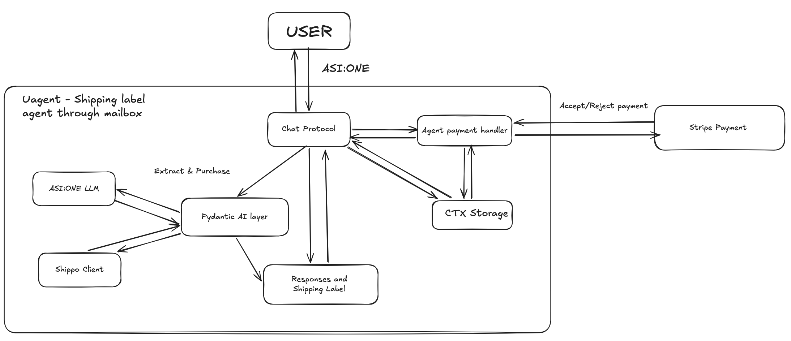

# Shipping Label Booking Agent (Pydantic AI)

The first [Pydantic AI](https://ai.pydantic.dev/) example in this repo. It shops shipping rates across whatever carriers are connected in Shippo, and buys the label once you approve the price, entirely through ASI:One Interactive Cards.

Demo video: https://youtu.be/ZR83LAA2lJI

## Architecture



See [`ARCHITECTURE.md`](ARCHITECTURE.md) for the component breakdown, the approval-gate sequence diagram, and the full session state machine.

## Setup

```bash
cd pydantic-agent/shipping-label-agent
python -m venv .venv && source .venv/bin/activate
pip install -r requirements.txt
cp .env.example .env   # fill in your test keys
python agent.py
```

You need a test-mode key for each of:

| Key                                            | Where to get it                                                      |
| ---------------------------------------------- | -------------------------------------------------------------------- |
| `ASI_ONE_API_KEY`                              | [asi1.ai/dashboard/api-keys](https://asi1.ai/dashboard/api-keys)     |
| `STRIPE_SECRET_KEY` / `STRIPE_PUBLISHABLE_KEY` | Stripe Dashboard → Developers → API keys (`sk_test_…` / `pk_test_…`) |
| `SHIPPO_TOKEN`                                 | Shippo Dashboard → API (`shippo_test_…`)                             |

Test credentials:

- Stripe success: `4242 4242 4242 4242`. Stripe decline: `4000 0000 0000 0002`
  (Stripe's documented `card_declined` card).
- Shippo: any `shippo_test_…` token. Labels are watermarked `SAMPLE - DO NOT MAIL`.

## Tests

```bash
source .venv/bin/activate
ruff format --check . && ruff check . && mypy .
pytest -q
```

All 88 tests run offline, with no ASI:One, Stripe, or Shippo network calls, using `FunctionModel`/`TestModel` for the Pydantic AI agents and `httpx.MockTransport` for Shippo. Coverage includes the full happy path, payment decline, an invalid or auto-corrected address on either side of the shipment, zero rates returned, a carrier without pickup support, a Shippo transaction that doesn't resolve to `SUCCESS`, the label payment failing (verifying the deferred tool resumes with `ToolDenied` and Shippo's purchase endpoint is never called), the hazmat self-certification gate (stop vs. continue), the insurance skip-rule and re-quote math, pre-flight package sanity checks, and international fail-fast detection. `tests/conftest.py` fails loudly if any fixture key isn't a test key.

## Flow

1. **First message, payment gate.** A native `RequestPayment` message (not a card).ASI:One renders its own Stripe checkout sheet. Nothing else is discussed until Stripe confirms the session as paid.
2. **Ship-from profile** (`form`). Captured once per session, kept in a schema separate from the recipient, so the sender is never whatever the user typed as the recipient's name. Phone and email are both required here, not optional. USPS (and some other carriers) reject the label _purchase_ call, not the earlier address-validation or rate-shop calls, if either is blank, so this is caught immediately instead of after a Stripe charge has already cleared.
3. **Recipient + package** (`form`). Address, weight, dimensions, declared value. Non-US destinations are caught immediately (US domestic only), and the numbers are sanity-checked before any API call: zero/negative dimensions and an implausible declared value (over $10,000, XCover's ceiling) are rejected on the form.
4. **Address validation**, for both addresses. Shippo can consider an address deliverable while silently normalizing something you typed wrong (a city that doesn't match its own ZIP, most concretely). When that happens, a `review` card shows what you typed next to Shippo's suggested version and asks which one to use, instead of trusting either one blindly. A genuinely invalid address is rejected outright and sent back to the form.
5. **Rate shop** (`carousel`). A curated shortlist (cheapest, fastest, one recommended pick, deduplicated) with a tappable "see all N options" tile for the rest. If a heavy/oversized package legitimately returns only one or two rates (or none), that's explained in plain language rather than shown as an unexplained short list. Works with any carrier Shippo returns a rate for; USPS/UPS/FedEx/DHL Express are all handled identically (see _Carrier coverage_ below).
6. **Detail** (`detail`) on tap: full breakdown for one option.
7. **Hazmat self-certification** (`review`). Before buying, you confirm the contents. The card links the chosen carrier's own prohibited-items list. Choosing "this needs special handling" stops the purchase and points at the USPS HAZMAT and UPS Limited Quantity guides (many everyday items still ship without special declaration); it never buys a label. Choosing "nothing hazardous" continues.
8. **Insurance** (`review`), only when the declared value exceeds what the chosen service already covers for free ($100 by default, $50 for UPS Ground Saver). It offers XCover coverage at Shippo's documented 1.25% domestic rate; adding it re-quotes just that one service with `extra.insurance` set and carries the higher total forward. If the declared value is already covered, this step is skipped and stated plainly.
9. **Purchase approval** (`review`). This is where `requires_approval=True` actually fires: the purchase tool already deferred on the first Pydantic AI run, before this card was ever sent. Tapping confirm doesn't call Shippo yet; it triggers the second payment below, which is what resumes the deferred tool.
10. **Second payment**, for the exact label price (insurance included). Only a cleared charge resumes the deferred tool with `ToolApproved`, which is what actually calls Shippo. A decline resumes it with `ToolDenied` (no label is bought) and returns to step 5.
11. **Purchase.** Asserts `test == true` and `status == "SUCCESS"` before reporting success. The label ships as a direct link to Shippo's hosted PDF.
12. **Pickup**, conditional. USPS and DHL Express get a scheduling form; everything else gets a drop-off locator link for that carrier.
13. **Confirmation.** Tracking number, carrier, and the one "test label, not a real shipment" line, said once here and never repeated at any earlier step.

### Carrier coverage

A fresh Shippo test account returns USPS rates only. UPS, FedEx, and DHL Express appear in the carousel once their **test** carrier accounts are connected in the Shippo dashboard (Settings → Carriers). The agent rate-shops whatever's connected and doesn't hard-code a carrier list. Pickup eligibility and drop-off locator links are keyed by Shippo's own provider strings (`"USPS"`, `"UPS"`, `"FedEx"`, `"DHL Express"`) and cover all four identically; see `shipping.PICKUP_ELIGIBLE_PROVIDERS` / `shipping.DROP_OFF_LOCATORS`.

### Why a test label doesn't look like a retail one

These are documented carrier/Shippo test-mode behaviors, not agent bugs:

- **UPS Ground Saver labels show two addresses and two tracking numbers.** Ground Saver hands off to USPS for final-mile delivery, so the label legitimately carries both carriers' blocks. See UPS's [Ground Saver label spec](https://assets.ups.com/adobe/assets/urn:aaid:aem:af1b19f8-dce2-426a-bd91-7eed3f899a2d/original/as/ups-ground-saver-gtl-us-en.pdf).
- **Test tracking numbers are simulated placeholders.** Per Shippo: "Test mode generates tracking numbers, but does not update the tracking information" ([Testing the Shippo API](https://docs.goshippo.com/docs/Guides_general/testing)). The number in chat and the one on the label PDF can legitimately differ.
- **The `SAMPLE`/`VOID` watermark is expected**, per Shippo's own docs: test-mode labels "are not real labels... [and] will have VOID, or Sample Do Not Use printed on them" ([How to Use Test Mode](https://support.goshippo.com/hc/en-us/articles/360003902611)).
- **Some UPS test labels render as a bare placeholder template** instead of a graphic label. Per Shippo's [carrier capabilities](https://docs.goshippo.com/docs/carriers/carriercapabilities) docs, UPS (unlike USPS) requires connecting your own carrier account even in test mode, and how fully that test account is provisioned appears to affect label fidelity.
- **A missing sender email/phone only fails at label purchase, not before.** Per Shippo's own [troubleshooting doc](https://support.goshippo.com/hc/en-us/articles/115002024943-Troubleshooting-Common-Error-Messages-in-Shippo), USPS rejects the transaction call, not the earlier address-validation or rate-shop calls, if the sender's email or phone is blank. That's why both are required fields on the sender-profile form rather than optional.

## Known limitations

By design, this example does not implement:

- **International shipping and customs forms**: US domestic only. Non-US addresses are detected early and refused with an explanation rather than failing at rate-shopping.
- **Multiple packages in a single session**: one parcel per booking.
- **Fully regulated hazmat**: the self-certification step stops the shipment and points at the carriers' own HAZMAT/Limited-Quantity processes; it does not file dangerous-goods paperwork or filter services down to a ground-only subset.
- **Carrier-direct insurance**: insurance uses Shippo's default XCover provider only, not FedEx/UPS/OnTrac carrier-provided coverage.
- **Editing or cancelling a booked pickup**: Shippo has no API for this; you'd contact the carrier directly with the confirmation code.
- **Any live Stripe or Shippo account**: real charges and real shipments are intentionally impossible here.
- **Uploading the label to Agentverse External Storage**: it's delivered as a direct link to Shippo's own hosted PDF instead, which is simpler and doesn't require an Agentverse API key.

## License

Apache 2.0. See the root [`LICENSE`](../../LICENSE) of the Innovation Lab repository.
